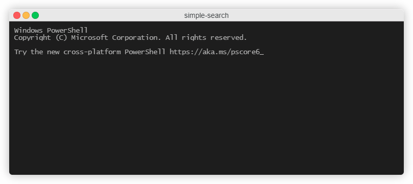

## Simple Search Strategy

Program that let you search for people using 3 search strategies. Project uses the **inverted index data structure** and design patterns such as **strategy** and **template**. It also reads data from txt file.

Search strategies:
ALL - displays lines from file containing all the words from the query.
ANY - displays lines from file containing at least one word from the query.
NONT - displays lines from file that do not contain words from the query at all.

## Table of contents

- [Screencast](#screencast)
- [General info](#general-info)
- [Technologies](#technologies)
- [Status](#status)
- [Inspiration](#inspiration)

## Screencast

## General info

Start main at src/SimpleSearch.java

## Technologies

Java

## Status

Project is: _finished_

## Inspiration

Hyperskill project
